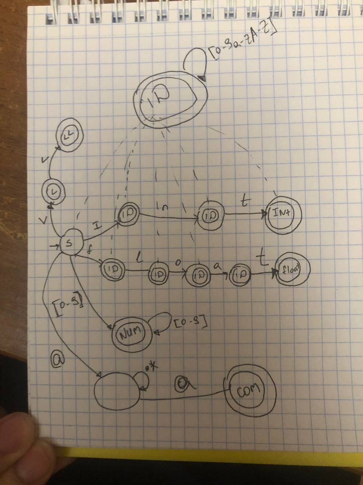

% Лабораторная работа № 1.4 «Лексический распознаватель»
% 19 марта 2025 г.
% Шоди Шоимов, ИУ9-62Б

# Цель работы
Целью данной работы является изучение использования детерминированных конечных 
автоматов с размеченными заключительными состояниями (лексических распознавателей) 
для решения задачи лексического анализа.

# Индивидуальный вариант
int, float, <, <<, комментарии ограничены знаками @, могут пересекать границы строк текста.

# Реализация


Граф детерминированного распознавателя:



Реализация распознавателя:

Файл `Position.py`:
```python
class Position:
    def __init__(self, text, line=1, pos=1, index=0):
        self.text = text  # Исходный текст программы
        self.line = line  # Номер текущей строки
        self.pos = pos    # Позиция в текущей строке
        self.index = index  # Индекс в тексте

    def Line(self):
        return self.line

    def Pos(self):
        return self.pos

    def Index(self):
        return self.index

    def __lt__(self, other):  # <
        return self.index < other.index

    def __eq__(self, other):  # ==
        return self.index == other.index

    def __le__(self, other):  # <=
        return self.index <= other.index

    def ToString(self):
        return f"({self.line}, {self.pos})"

    def Cp(self):
        return -1 if self.index == len(self.text) else self.text[self.index]

    def Uc(self):
        return "OtherNotAssigned" if self.index == len(self.text) else unicodedata.category(chr(self.Cp()))

    def isWhiteSpace(self):
        return self.index != len(self.text) and self.text[self.index].isspace()

    def IsLetter(self):
        return self.index != len(self.text) and self.text[self.index].isalpha()

    def IsLetterOrDigit(self):
        return self.index != len(self.text) and (self.text[self.index].isalpha() or ('0' <= self.text[self.index] <= '9'))

    def IsDecimalDigit(self):
        return self.index != len(self.text) and ('0' <= self.text[self.index] <= '9')

    def IsNewLine(self):
        if self.index == len(self.text):
            return False
        if self.text[self.index] == '\r' and self.index + 1 < len(self.text):
            return self.text[self.index + 1] == '\n'
        return self.text[self.index] == '\n'

    def next(self):
        if self.index < len(self.text):
            if self.IsNewLine():
                if self.text[self.index] == '\r':
                    self.index += 1
                self.line += 1
                self.pos = 1
            else:
                if 0xD800 <= ord(self.text[self.index]) <= 0xDBFF:
                    self.index += 1
                self.pos += 1
            self.index += 1
        return self
```

Файл `Token.py`:
```python
class Fragment:
    def __init__(self, starting, following):
        self.Starting = starting
        self.Following = following

    def ToString(self):
        return f"{self.Starting.ToString()} - {self.Following.ToString()}"

```

Файл `Message.py`:
```python
class Message:
    def __init__(self, IsError, Pos ,Text):
        self.IsError = IsError
        self.Position = Pos
        self.Text = Text
```

Файл `Token.py`:
```python

class DomainTag(enum.Enum):
    NUMBER = 1,
    IDENT = 2,
    LESS = 3,
    LESSER = 4,
    INT = 5,
    FLOAT = 6,
    END_OF_PROGRAM = 11


class Token:
    def __init__(self, tag, starting, following):
        self.Tag = tag
        self.Coords = Fragment(starting, following)


class NumberToken(Token):
    def __init__(self, starting, following, value: int):
        super().__init__(DomainTag.NUMBER, starting, following)
        self.value = value  # Атрибут: значение числа

    def __str__(self):
        return f"NUMBER {self.Coords.ToString()}: {self.value}"


class Ident(Token):
    def __init__(self, starting, following, value: str):
        super().__init__(DomainTag.IDENT, starting, following)
        self.value = value  # Атрибут: значение строки

    def __str__(self):
        return f"IDENT {self.Coords.ToString()}: {self.value}"


class SpecToken(Token):
    def __init__(self, tag: DomainTag, starting: Position, following: Position):
        # Проверяем, что tag является допустимым значением
        assert tag in {
            DomainTag.LESSER,
            DomainTag.LESS,
            DomainTag.INT,
            DomainTag.FLOAT,
            DomainTag.END_OF_PROGRAM
        }, f"Invalid tag for SpecToken: {tag}"

        # Вызываем конструктор базового класса
        super().__init__(tag, starting, following)

    def __str__(self):
        return f"SPEC {self.Coords.ToString()}: {self.Tag.name}"
```

Файл `Automata.py`:
```python
class Automat:
    def __init__(self):
        
        self.Table = [
                #  N    i    n    t    f    l    o    a    <   a-z   @  ' ' '\n'
                [  1,   2,  10,  10,   5,  10,  10,  10,   8,  10,  11,  0,  0],  # 0
                [  1,   2,  10,  10,   5,  10,  10,  10,  -1,  10,  -1, -1, -1],  # 1
                [ 10,  10,  3,   10,  10,  10,  10,  10,  -1,  10,  -1, -1, -1],  # 2
                [ 10,  10,  10,   4,  10,  10,  10,  10,  -1,  10,  -1, -1, -1],  # 3
                [ 10,  10,  10,  10,  10,  10,  10,  10,  -1,  10,  -1, -1, -1],  # 4
                [ 10,  10,  10,  10,  10,   6,  10,  10,  -1,  10,  -1, -1, -1],  # 5
                [ 10,  10,  10,  10,  10,  10,   7,  10,  -1,  10,  -1, -1, -1],  # 6
                [ 10,  10,  10,  10,  10,  10,  10,  13,  -1,  10,  -1, -1, -1],  # 7
                [ -1,  -1,  -1,  -1,  -1,  -1,  -1,  -1,   9,  -1,  -1, -1, -1],  # 8
                [ -1,  -1,  -1,  -1,  -1,  -1,  -1,  -1,  -1,  -1,  -1, -1, -1],  # 9
                [ 10,  10,  10,  10,  10,  10,  10,  10,  -1,  10,  -1, -1, -1],  # 10
                [ 11,  11,  11,  11,  11,  11,  11,  11,  11,  11,  12, 11, 11],  # 11
                [ -1,  -1,  -1,  -1,  -1,  -1,  -1,  -1,  -1,  -1,  -1, -1, -1],  # 12
                [ 10,  10,  10,  14,  10,  10,  10,  10,  -1,  10,  -1, -1, -1],  # 13
                [ 10,  10,  10,  10,  10,  10,  10,  10,  -1,  10,  -1, -1, -1]  # 14
                ]
        self.Finals = [1,2,3,4,5,6,7,8,9,10,12]

    def NextState(self,pos: Position,CurState):
        if pos.Cp() == 'i':
            return self.Table[CurState][1]
        elif pos.Cp() == 'n':
            return self.Table[CurState][2]
        elif pos.Cp() == 't':
            return self.Table[CurState][3]
        elif pos.Cp() == 'f':
            return self.Table[CurState][4]
        elif pos.Cp() == 'l':
            return self.Table[CurState][5]
        elif pos.Cp() == 'o':
            return self.Table[CurState][6]
        elif pos.Cp() == 'a':
            return self.Table[CurState][7]
        elif pos.Cp() == '<':
            return self.Table[CurState][8]
        elif pos.Cp() == '@':
            return self.Table[CurState][10]
        elif pos.IsLetter():
            return self.Table[CurState][9]
        elif pos.Cp() == -1:
            return -1
        elif pos.isWhiteSpace():
            return self.Table[CurState][11]
        elif pos.IsNewLine():
            return self.Table[CurState][12]
        elif pos.IsDecimalDigit():
            return self.Table[CurState][0]
        else:
            return -1
        
```
Файл `Lexer.py`:
```python
class Lexer:
    def __init__(self, program: str):
        self.program = program
        self.position = Position(program)
        self.tokens: List[Token] = []
        self.comments: List[Fragment] = []
        self.errors: List[Message] = []
        self.a = Automat()
        self.current_state = 0
        self.prev_state = 0

    def NextToken(self):
        while self.position.Cp() != -1:
            self.skip()

            start = Position(self.program, self.position.line, self.position.pos, self.position.index)
            self.current_state = 0
          

            while self.current_state != -1 and self.position.Cp() != -1:
                self.prev_state = self.current_state
                self.current_state = self.a.NextState(self.position, self.current_state)
                
                if self.current_state == 11:
                    
                    self.position.next()
                    self.prev_state = self.current_state
                    self.current_state = self.a.NextState(self.position, self.current_state)
                    while self.current_state !=12:
                       
                        if self.position.Cp() == -1:
                            self.errors.append(Message(True, self.position, f"Expected end of comment"))
                      
                        self.position.next()
                        self.prev_state = self.current_state
                        self.current_state = self.a.NextState(self.position, self.current_state)
                temp = Position(self.program, self.position.line, self.position.pos, self.position.index)

                if self.prev_state == 1 and self.current_state == 10:
                    end = Position(self.program, self.position.line, self.position.pos, self.position.index)
                    self.process_token(start, end)
                    start = Position(self.program, self.position.line, self.position.pos, self.position.index)
                    self.current_state = 0  # Сбрасываем состояние для нового токена
                    continue

               
                if self.current_state == -1 and self.position.Cp()!=-1:
                   
                    end = Position(self.program, self.position.line, self.position.pos, self.position.index)
                    if not(self.position.IsNewLine() or self.position.isWhiteSpace()):
                       
                        
                        if not(temp.next().isWhiteSpace()):
                            while  not(temp.next().isWhiteSpace()):
                                self.position = temp
                                temp.next()
                           
                           
                        self.position.next()
                        self.errors.append(Message(True, end, f"Invalid token at "))
                        self.process_token(start,self.position)
                       
                    else:
                        self.process_token(start,end)
                if self.current_state != -1 and temp.next().Cp() ==-1:
                    
                    self.position.next()
                    end = Position(self.program, self.position.line, self.position.pos, self.position.index)
                    self.prev_state = self.current_state
                    self.process_token(start,end)
            
                self.position.next()
            

    def skip(self):
        while self.position.isWhiteSpace() or self.position.IsNewLine():
            self.position.next()

    def process_token(self, start: Position, end: Position):
        lexeme = self.program[start.Index():end.Index()]
        if self.prev_state == 1:
            self.tokens.append(NumberToken(start, end, lexeme))
        elif self.prev_state == 10:
            self.tokens.append(Ident(start, end, lexeme))
        elif self.prev_state == 14:
            self.tokens.append(SpecToken(DomainTag.FLOAT, start, end))
        elif self.prev_state == 4:
            self.tokens.append(SpecToken(DomainTag.INT, start, end))
        elif self.prev_state == 8:
            self.tokens.append(SpecToken(DomainTag.LESS, start, end))
        elif self.prev_state == 9:
            self.tokens.append(SpecToken(DomainTag.LESSER, start, end))
        elif self.prev_state == 12:
            self.comments.append(Fragment(start, end))
```

# Тестирование

Входные данные

```
123 qwe < << int float
123int
444float
int
```

Вывод на `stdout`

```
Tokens:
NUMBER (1, 1) - (1, 4): 123
IDENT (1, 5) - (1, 8): qwe
SPEC (1, 9) - (1, 10): LESS
SPEC (1, 11) - (1, 13): LESSER
SPEC (1, 14) - (1, 17): INT
SPEC (1, 18) - (1, 23): FLOAT
SPEC (2, 1) - (2, 7): INT
SPEC (3, 1) - (3, 9): FLOAT
SPEC (4, 1) - (4, 4): INT

Errors:

Comments:
```

# Вывод
В ходе выполнения лабораторной работы был разработан лексический анализатор для заданного модельного языка,
успешно распознающий шесть типов лексем: пробелы, идентификаторы, целочисленные литералы, ключевые слова 
(int, float), знаки операций (<, <<) и комментарии, ограниченные символами @.

Было особенно приятно вспомнить и закрепить материал по конечным автоматам, изученный в курсе ТФЯ, и 
применить эти теоретические знания для решения конкретной практической задачи - построения лексического 
анализатора.

Работа подтвердила, что подход на основе детерминированных конечных автоматов остается эффективным и 
практичным методом для задач лексического анализа, а полученные навыки могут быть полезны при разработке
более сложных языковых процессоров.
